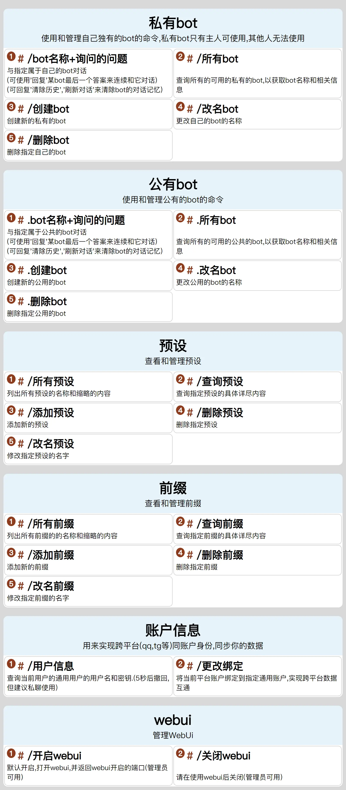

<div align="center">
  <a href="https://github.com/canxin121">
    
  </a>
  <h1>Nonebot_plugin_templates</h1>
</div>

<p align="center">
    <a href="https://pypi.python.org/pypi/nonebot-plugin-templates">
    
    </a>
    
    
    <br />
    <a href="https://onebot.dev/">
    
    <a href="https://github.com/canxin121/nonebot_poe_chat/releases/">
    
    </a>
</p>
<div align="left">

## 最新版本号0.1.3

# 功能:提供一些jinja2 templates渲染,并提供构建所需参数的类

> 构建一个菜单的示例

```python
from nonebot_plugin_templates.template_types import *
from nonebot_plugin_templates.templates_render import menu_render, colorlist_render

menu = Menu("私有bot", des="使用和管理自己独有的bot的命令,私有bot只有主人可使用,其他人无法使用",
            funcs=Funcs(
                Func("/bot名称+询问的问题",
                     "与指定属于自己的bot对话\n(可使用'回复'某bot最后一个答案来连续和它对话)\n(可回复'清除历史','刷新对话'来清除bot的对话记忆)") +
                Func("/所有bot",
                     "查询所有的可用的私有的bot,以获取bot名称和相关信息") +
                Func("/创建bot", "创建新的私有的bot") +
                Func("/改名bot", "更改自己的bot的名称") +
                Func("/删除bot", "删除指定自己的bot")))
menu += Menu("公有bot", des="使用和管理公有的bot的命令",
             funcs=Funcs(
                 Func("bot名称+询问的问题",
                      "与指定属于公共的bot对话\n(可使用'回复'某bot最后一个答案来连续和它对话)\n(可回复'清除历史','刷新对话'来清除bot的对话记忆)") +
                 Func("所有bot", "查询所有的可用的公共的bot,以获取bot名称和相关信息") +
                 Func("创建bot", "创建新的公用的bot") +
                 Func("改名bot", "更改公用的bot的名称") +
                 Func("删除bot", "删除指定公用的bot")))
pic_bytes = await menu_render(menu, 800)
```



> 构建一个卡片列表的示例